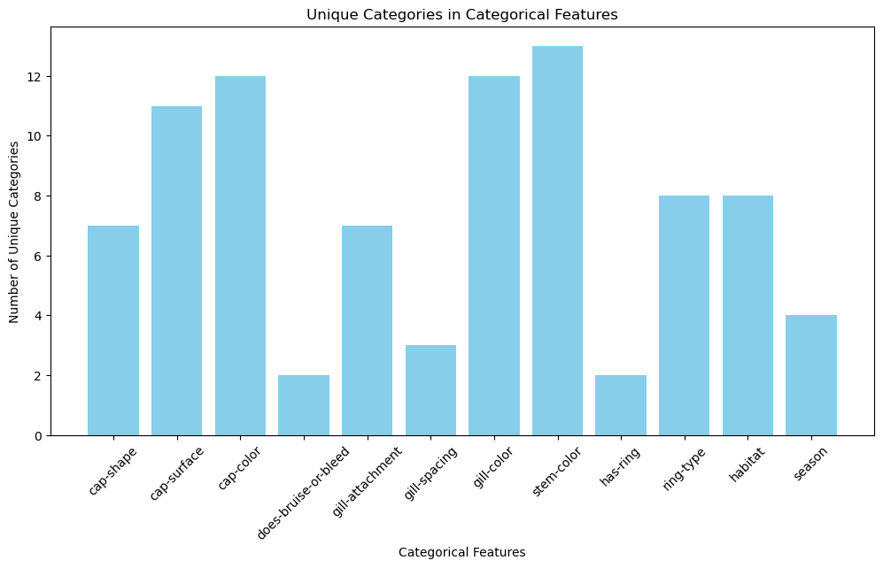
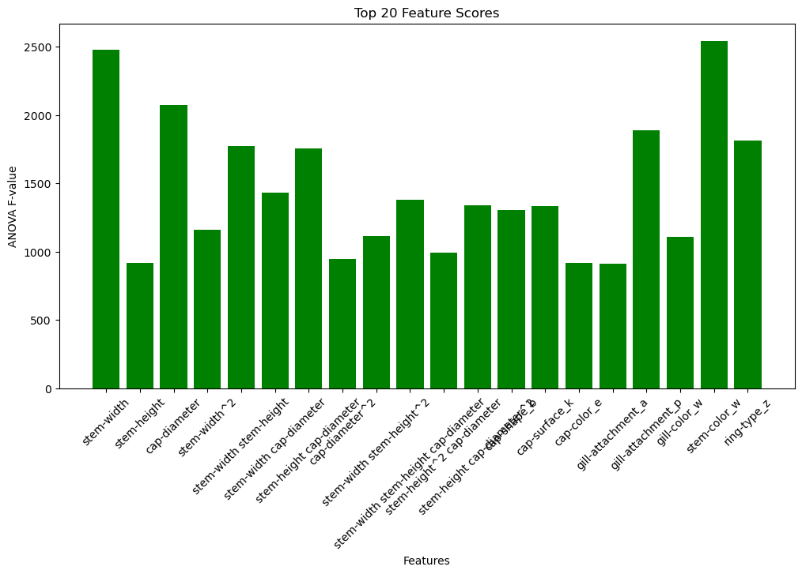
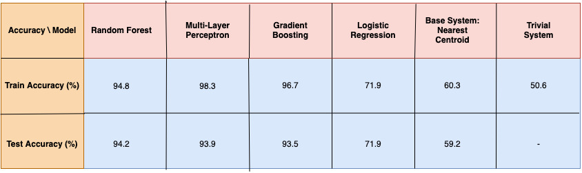
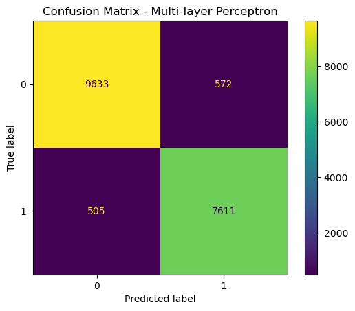
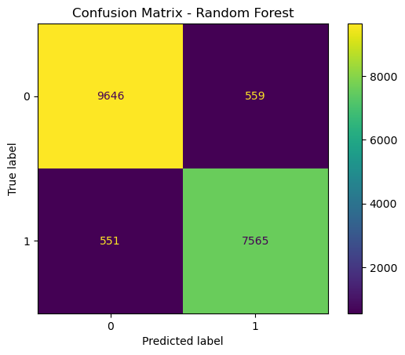
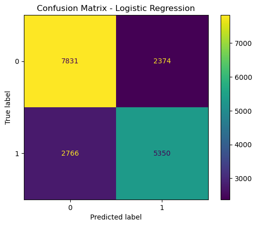

# Mushroom Classification Project
## Project Overview

This project focuses on classifying mushrooms into edible and poisonous categories. Using a dataset containing 61,069 instances of 173 mushroom species, the goal is to analyze 15 different features (such as cap shape and stem height) to build accurate classification models. We employ various machine learning techniques, including Random Forest and Multi-Layer Perceptron, to achieve this.
## Features and Dataset
    Dataset: The dataset includes 61,069 mushrooms categorized into 173 species.
    Features: 15 features per mushroom, including physical characteristics like cap shape, color, and dimensions.
### The (12) Categorical Features in the dataset
 

## Feature Engineering: The Top Extracted (and the Used) Features
 

## Models Used
    1. Random Forest
    2. Multi-Layer Perceptron
    3. Logistic Regression
    4. Gradient Boosting

## Results
### Accuracy Rates for Different Models
 
### Confusion Matrix for Different Models
 

 

